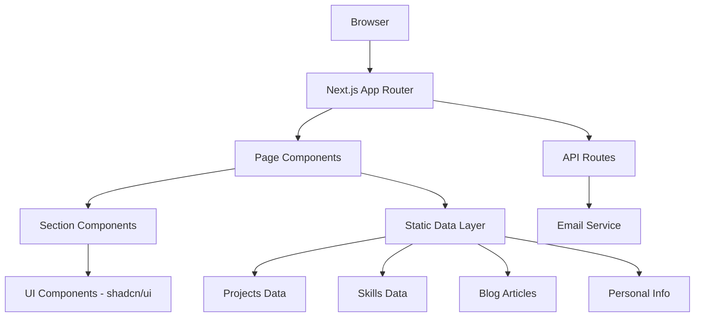

# Design Document: Portfolio Website

## Overview

This design document outlines the technical architecture for Melnar Ancit Cordova's portfolio website. The site will be built as a static Next.js application using the App Router, styled with Tailwind CSS, and enhanced with shadcn/ui components. The architecture prioritizes simplicity, performance, and maintainability by using static data sources and server-side generation.

The application follows a component-based architecture with clear separation between data, presentation, and business logic. All content is stored as static TypeScript/JSON files, eliminating the need for a database while maintaining type safety and ease of updates.

## Architecture

### High-Level Architecture



### Technology Stack

- **Framework**: Next.js 14+ (App Router with React Server Components)
- **Styling**: Tailwind CSS 3.x
- **UI Components**: shadcn/ui (Radix UI primitives)
- **Language**: TypeScript
- **Email**: Resend or similar email service for contact form
- **Deployment**: Vercel (recommended) or any static hosting platform
- **Icons**: lucide-react (included with shadcn/ui)

### Architectural Decisions

1. **Static Site Generation (SSG)**: All pages will be pre-rendered at build time for optimal performance
2. **Server Components**: Use React Server Components by default for better performance
3. **Client Components**: Only use client components where interactivity is required (contact form, navigation menu)
4. **File-based Data**: Store all content in TypeScript files for type safety and version control
5. **API Routes**: Minimal API routes only for contact form submission

## Components and Interfaces

### Data Models

```typescript
// types/portfolio.ts

export interface TechStack {
  name: string;
  icon: string; // Icon name from lucide-react or URL
  category: 'language' | 'framework' | 'tool' | 'database';
}

export interface Project {
  id: string;
  title: string;
  description: string;
  longDescription?: string;
  technologies: string[]; // Array of tech names
  liveUrl?: string;
  repoUrl?: string;
  imageUrl?: string;
  featured: boolean;
  order: number;
}

export interface Skill {
  name: string;
  category: string;
  proficiency: 'beginner' | 'intermediate' | 'advanced' | 'expert';
  yearsOfExperience?: number;
}

export interface SkillCategory {
  name: string;
  skills: Skill[];
  order: number;
}

export interface BlogPost {
  slug: string;
  title: string;
  excerpt: string;
  content: string; // Markdown content
  publishedDate: string; // ISO date string
  tags: string[];
  readingTime: number; // minutes
}

export interface PersonalInfo {
  fullName: string;
  title: string;
  bio: string;
  email: string;
  github: string;
  linkedin?: string;
  twitter?: string;
  location?: string;
}

export interface ContactFormData {
  name: string;
  email: string;
  message: string;
}
```

### Component Structure

#### Page Components

1. **app/page.tsx** - Main landing page containing all sections
2. **app/blog/page.tsx** - Blog listing page
3. **app/blog/[slug]/page.tsx** - Individual blog post page
4. **app/layout.tsx** - Root layout with navigation and footer

#### Section Components

1. **components/sections/HeroSection.tsx**
   - Displays name, title, bio
   - Shows tech stack icons
   - Includes GitHub link
   - Props: `personalInfo: PersonalInfo, techStack: TechStack[]`

2. **components/sections/ProjectsSection.tsx**
   - Renders project grid
   - Handles responsive layout
   - Props: `projects: Project[]`

3. **components/sections/SkillsSection.tsx**
   - Displays skills matrix by category
   - Shows proficiency indicators
   - Props: `skillCategories: SkillCategory[]`

4. **components/sections/BlogSection.tsx**
   - Shows recent blog posts
   - Links to full blog page
   - Props: `posts: BlogPost[], limit?: number`

5. **components/sections/ContactSection.tsx**
   - Contains contact form
   - Shows social links
   - Props: `personalInfo: PersonalInfo`

#### UI Components (using shadcn/ui)

1. **components/ui/project-card.tsx**
   - Displays individual project
   - Shows tech badges
   - Includes demo/repo links
   - Props: `project: Project`

2. **components/ui/skill-badge.tsx**
   - Shows skill with proficiency indicator
   - Visual representation of skill level
   - Props: `skill: Skill`

3. **components/ui/blog-card.tsx**
   - Displays blog post preview
   - Shows metadata (date, reading time)
   - Props: `post: BlogPost`

4. **components/ui/contact-form.tsx** (Client Component)
   - Form with validation
   - Submit handler
   - Success/error states
   - Props: None (self-contained)

5. **components/ui/navigation.tsx** (Client Component)
   - Sticky navigation bar
   - Smooth scroll to sections
   - Mobile hamburger menu
   - Active section indicator

6. **components/ui/tech-icon.tsx**
   - Renders technology icon
   - Tooltip with tech name
   - Props: `tech: TechStack`

#### Utility Components

1. **components/ui/section-container.tsx**
   - Consistent section spacing and layout
   - Props: `children, id?, className?`

2. **components/ui/markdown-renderer.tsx**
   - Renders markdown content for blog posts
   - Syntax highlighting for code blocks
   - Props: `content: string`

### Data Layer

```typescript
// data/personal-info.ts
export const personalInfo: PersonalInfo = {
  fullName: "Melnar Ancit Cordova",
  title: "CRM & Software Engineer",
  bio: "Building scalable solutions and crafting elegant code...",
  email: "narancit@gmail.com",
  github: "https://github.com/narancit",
  // ... other fields
};

// data/tech-stack.ts
export const techStack: TechStack[] = [
  { name: "TypeScript", icon: "code", category: "language" },
  { name: "React", icon: "react", category: "framework" },
  // ... more technologies
];

// data/projects.ts
export const projects: Project[] = [
  {
    id: "project-1",
    title: "Project Name",
    description: "Brief description",
    technologies: ["TypeScript", "Next.js"],
    liveUrl: "https://...",
    repoUrl: "https://github.com/...",
    featured: true,
    order: 1,
  },
  // ... more projects
];

// data/skills.ts
export const skillCategories: SkillCategory[] = [
  {
    name: "Programming Languages",
    order: 1,
    skills: [
      { name: "TypeScript", category: "Programming Languages", proficiency: "expert" },
      // ... more skills
    ],
  },
  // ... more categories
];

// data/blog-posts.ts
export const blogPosts: BlogPost[] = [
  {
    slug: "my-first-post",
    title: "Getting Started with...",
    excerpt: "In this post...",
    content: "# Full markdown content...",
    publishedDate: "2024-01-15",
    tags: ["typescript", "tutorial"],
    readingTime: 5,
  },
  // ... more posts
];
```

### API Routes

```typescript
// app/api/contact/route.ts
import { NextRequest, NextResponse } from 'next/server';
import { Resend } from 'resend';

export async function POST(request: NextRequest) {
  // Validate request body
  // Send email using Resend
  // Return success/error response
}
```

## Data Models

### Type Definitions

All data models are defined in `types/portfolio.ts` as shown in the Components section above.

### Data Validation

```typescript
// lib/validation.ts
import { z } from 'zod';

export const contactFormSchema = z.object({
  name: z.string().min(2, "Name must be at least 2 characters"),
  email: z.string().email("Invalid email address"),
  message: z.string().min(10, "Message must be at least 10 characters"),
});

export type ContactFormInput = z.infer<typeof contactFormSchema>;
```

### Data Access Layer

```typescript
// lib/data-access.ts

export function getAllProjects(): Project[] {
  return projects.sort((a, b) => a.order - b.order);
}

export function getFeaturedProjects(): Project[] {
  return projects.filter(p => p.featured).sort((a, b) => a.order - b.order);
}

export function getAllSkillCategories(): SkillCategory[] {
  return skillCategories.sort((a, b) => a.order - b.order);
}

export function getAllBlogPosts(): BlogPost[] {
  return blogPosts.sort((a, b) => 
    new Date(b.publishedDate).getTime() - new Date(a.publishedDate).getTime()
  );
}

export function getBlogPostBySlug(slug: string): BlogPost | undefined {
  return blogPosts.find(post => post.slug === slug);
}

export function getRecentBlogPosts(limit: number = 3): BlogPost[] {
  return getAllBlogPosts().slice(0, limit);
}
```

## Styling and Theme

### Tailwind Configuration

```typescript
// tailwind.config.ts
import type { Config } from 'tailwindcss';

const config: Config = {
  darkMode: ['class'],
  content: [
    './pages/**/*.{ts,tsx}',
    './components/**/*.{ts,tsx}',
    './app/**/*.{ts,tsx}',
  ],
  theme: {
    extend: {
      colors: {
        background: '#000000',
        foreground: '#ffffff',
        primary: {
          DEFAULT: '#00ff00',
          foreground: '#000000',
        },
        secondary: {
          DEFAULT: '#64748b', // slate-500
          foreground: '#ffffff',
        },
        muted: {
          DEFAULT: '#1e293b', // slate-800
          foreground: '#94a3b8', // slate-400
        },
        accent: {
          DEFAULT: '#00ff00',
          foreground: '#000000',
        },
      },
    },
  },
  plugins: [require('tailwindcss-animate')],
};

export default config;
```

### Design Tokens

- **Primary Background**: `#000000` (black)
- **Primary Accent**: `#00ff00` (neon green)
- **Secondary Text**: `#64748b` (slate gray)
- **Muted Background**: `#1e293b` (dark slate)
- **Text Primary**: `#ffffff` (white)
- **Text Secondary**: `#94a3b8` (light slate)

### Responsive Breakpoints

- **Mobile**: < 768px
- **Tablet**: 768px - 1023px
- **Desktop**: ≥ 1024px

### Component Styling Patterns

1. **Section Spacing**: Consistent `py-16 md:py-24` for all major sections
2. **Container Width**: Max width of `1280px` with horizontal padding
3. **Card Styling**: Dark background with subtle border and hover effects
4. **Interactive Elements**: Neon green accent on hover/focus states
5. **Typography**: Clear hierarchy with consistent font sizes

## Authentication

### Resume Download Protection

Since the resume download should only be accessible to Melnar (the site owner), we'll implement a simple authentication mechanism:

```typescript
// lib/auth.ts
import { cookies } from 'next/headers';

export function isAuthenticated(): boolean {
  const cookieStore = cookies();
  const authToken = cookieStore.get('auth_token');
  
  if (!authToken) return false;
  
  // Simple token validation
  return authToken.value === process.env.AUTH_TOKEN;
}

// app/api/auth/login/route.ts
export async function POST(request: NextRequest) {
  const { password } = await request.json();
  
  if (password === process.env.ADMIN_PASSWORD) {
    const response = NextResponse.json({ success: true });
    response.cookies.set('auth_token', process.env.AUTH_TOKEN!, {
      httpOnly: true,
      secure: process.env.NODE_ENV === 'production',
      sameSite: 'strict',
      maxAge: 60 * 60 * 24 * 7, // 7 days
    });
    return response;
  }
  
  return NextResponse.json({ success: false }, { status: 401 });
}

// app/api/auth/logout/route.ts
export async function POST() {
  const response = NextResponse.json({ success: true });
  response.cookies.delete('auth_token');
  return response;
}
```

### Protected Resume Download

```typescript
// app/api/resume/download/route.ts
import { isAuthenticated } from '@/lib/auth';
import { NextResponse } from 'next/server';
import fs from 'fs';
import path from 'path';

export async function GET() {
  if (!isAuthenticated()) {
    return NextResponse.json({ error: 'Unauthorized' }, { status: 401 });
  }
  
  const resumePath = path.join(process.cwd(), 'public', 'resume.pdf');
  const resumeBuffer = fs.readFileSync(resumePath);
  
  return new NextResponse(resumeBuffer, {
    headers: {
      'Content-Type': 'application/pdf',
      'Content-Disposition': 'attachment; filename="Melnar_Cordova_Resume.pdf"',
    },
  });
}
```

### Admin UI Component

```typescript
// components/ui/admin-panel.tsx (Client Component)
'use client';

import { useState } from 'react';
import { Button } from '@/components/ui/button';
import { Input } from '@/components/ui/input';

export function AdminPanel({ isAuthenticated }: { isAuthenticated: boolean }) {
  const [password, setPassword] = useState('');
  const [showLogin, setShowLogin] = useState(false);
  
  const handleLogin = async () => {
    const response = await fetch('/api/auth/login', {
      method: 'POST',
      headers: { 'Content-Type': 'application/json' },
      body: JSON.stringify({ password }),
    });
    
    if (response.ok) {
      window.location.reload();
    }
  };
  
  const handleLogout = async () => {
    await fetch('/api/auth/logout', { method: 'POST' });
    window.location.reload();
  };
  
  const handleDownloadResume = async () => {
    const response = await fetch('/api/resume/download');
    if (response.ok) {
      const blob = await response.blob();
      const url = window.URL.createObjectURL(blob);
      const a = document.createElement('a');
      a.href = url;
      a.download = 'Melnar_Cordova_Resume.pdf';
      a.click();
    }
  };
  
  if (isAuthenticated) {
    return (
      <div className="fixed bottom-4 right-4 flex gap-2">
        <Button onClick={handleDownloadResume} variant="default">
          Download Resume
        </Button>
        <Button onClick={handleLogout} variant="outline">
          Logout
        </Button>
      </div>
    );
  }
  
  if (showLogin) {
    return (
      <div className="fixed bottom-4 right-4 flex gap-2">
        <Input
          type="password"
          value={password}
          onChange={(e) => setPassword(e.target.value)}
          placeholder="Admin password"
          className="w-40"
        />
        <Button onClick={handleLogin}>Login</Button>
        <Button onClick={() => setShowLogin(false)} variant="ghost">Cancel</Button>
      </div>
    );
  }
  
  return (
    <Button
      onClick={() => setShowLogin(true)}
      variant="ghost"
      size="sm"
      className="fixed bottom-4 right-4 opacity-20 hover:opacity-100"
    >
      Admin
    </Button>
  );
}
```


## Correctness Properties

A property is a characteristic or behavior that should hold true across all valid executions of a system—essentially, a formal statement about what the system should do. Properties serve as the bridge between human-readable specifications and machine-verifiable correctness guarantees.

### Rendering Properties

**Property 1: Collection Rendering Completeness**
*For any* collection of data items (tech stack, projects, skills, blog posts), when rendered by the Portfolio_Site, the number of rendered elements should equal the number of items in the source data.
**Validates: Requirements 1.2, 2.1, 3.1, 4.1**

**Property 2: Required Fields Presence**
*For any* data item (project, skill, blog post), when rendered by the Portfolio_Site, the output should contain all required fields specified in the data model (e.g., project name/description/technologies, skill name/proficiency, blog title/date/excerpt).
**Validates: Requirements 2.2, 3.2, 4.2**

**Property 3: Conditional Field Rendering**
*For any* project with optional fields (liveUrl or repoUrl), when rendered by the Portfolio_Site, a clickable link should be present if and only if the corresponding URL field is defined in the data.
**Validates: Requirements 2.3, 2.4**

**Property 4: Skills Category Organization**
*For any* set of skills with category assignments, when rendered in the Skills_Matrix, each skill should appear under its designated category and only under that category.
**Validates: Requirements 3.3**

**Property 5: Blog Navigation Correctness**
*For any* blog post in the blog listing, when a visitor clicks on it, the Portfolio_Site should navigate to a URL containing the post's slug and display that post's full content.
**Validates: Requirements 4.3**

**Property 6: Markdown Code Block Formatting**
*For any* blog post content containing markdown code blocks (denoted by triple backticks), when rendered by the Portfolio_Site, the code should be displayed with syntax highlighting and preserved formatting.
**Validates: Requirements 4.4**

### Form Validation Properties

**Property 7: Valid Contact Form Submission**
*For any* contact form data with non-empty name (≥2 chars), valid email format, and non-empty message (≥10 chars), when submitted, the Portfolio_Site should successfully send an email and return a success response.
**Validates: Requirements 5.2**

**Property 8: Invalid Contact Form Rejection**
*For any* contact form data that violates validation rules (empty name, invalid email, short message), when submitted, the Portfolio_Site should display specific validation error messages and not send an email.
**Validates: Requirements 5.3**

### Styling and Accessibility Properties

**Property 9: Interactive Element Accent Color**
*For any* interactive element (buttons, links, form inputs), when rendered or in hover/focus state, the Portfolio_Site should apply the neon green accent color (#00ff00 or similar).
**Validates: Requirements 6.2**

**Property 10: Text Contrast Compliance**
*For any* text element rendered by the Portfolio_Site, the contrast ratio between the text color and its background should meet WCAG AA standards (minimum 4.5:1 for normal text, 3:1 for large text).
**Validates: Requirements 6.4**

**Property 11: Touch Target Sizing**
*For any* interactive element (buttons, links, form controls), when rendered on touch devices, the element should have a minimum touch target size of 44x44 pixels to ensure accessibility.
**Validates: Requirements 7.5**

**Property 12: Image Optimization**
*For any* image asset used in the Portfolio_Site, the image should be served in an optimized format (WebP or AVIF) with appropriate dimensions and quality settings for web delivery.
**Validates: Requirements 9.5**

### Navigation Properties

**Property 13: Navigation Scroll Behavior**
*For any* navigation link corresponding to a page section, when clicked, the Portfolio_Site should smoothly scroll the viewport to position that section at the top of the visible area.
**Validates: Requirements 10.2**

**Property 14: Active Section Indication**
*For any* scroll position within the page, the Portfolio_Site should highlight the navigation link corresponding to the section currently in the viewport.
**Validates: Requirements 10.3**

**Property 15: Keyboard Navigation Accessibility**
*For any* interactive element in the navigation menu, the element should be reachable via keyboard Tab navigation and activatable via Enter or Space key.
**Validates: Requirements 10.5**

### Responsive Design Properties

**Property 16: Hero Section Viewport Visibility**
*For any* viewport width between 320px and 2560px, when the Portfolio_Site loads, the Hero_Section should be fully visible without horizontal scrolling and maintain proper text readability.
**Validates: Requirements 1.4**

## Error Handling

### Contact Form Errors

1. **Validation Errors**: Display inline error messages for each invalid field
2. **Network Errors**: Show user-friendly message if email service is unavailable
3. **Rate Limiting**: Implement rate limiting to prevent spam (max 5 submissions per hour per IP)

### Blog Post Errors

1. **Missing Post**: Display 404 page if blog post slug doesn't exist
2. **Markdown Parsing Errors**: Gracefully handle malformed markdown with fallback rendering

### Authentication Errors

1. **Invalid Credentials**: Show error message without revealing whether username or password is incorrect
2. **Session Expiry**: Redirect to login if auth token expires during resume download attempt
3. **Missing Resume File**: Return appropriate error if resume PDF is not found

### Image Loading Errors

1. **Missing Images**: Display placeholder image if project/blog image fails to load
2. **Slow Loading**: Show skeleton loaders while images are loading

### API Route Errors

```typescript
// lib/error-handler.ts
export class APIError extends Error {
  constructor(
    public statusCode: number,
    message: string,
  ) {
    super(message);
  }
}

export function handleAPIError(error: unknown) {
  if (error instanceof APIError) {
    return NextResponse.json(
      { error: error.message },
      { status: error.statusCode }
    );
  }
  
  console.error('Unexpected error:', error);
  return NextResponse.json(
    { error: 'Internal server error' },
    { status: 500 }
  );
}
```

## Testing Strategy

Per project requirements, no automated tests are required for this portfolio website.

### Manual Testing Checklist

Here's a manual testing checklist for verification:

1. **Visual Testing**: Verify dark theme, neon green accents, and responsive layouts
2. **Cross-browser Testing**: Test on Chrome, Firefox, Safari, and Edge
3. **Device Testing**: Test on mobile, tablet, and desktop viewports
4. **Accessibility Testing**: Test keyboard navigation and screen reader compatibility
5. **Performance Testing**: Verify fast load times and optimized images
6. **Form Testing**: Test contact form with valid and invalid inputs
7. **Authentication Testing**: Verify resume download protection works correctly

